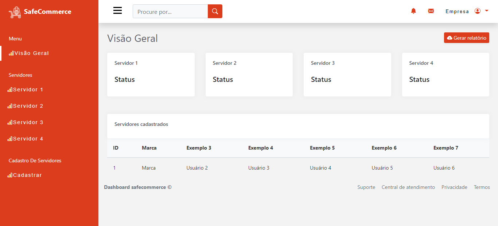

# Admin Dashboard (Em desenvolvimento)

Admin Dashboard desenvolvida para o projeto de 2º semestre do curso de ciências da computação da faculdade São Paulo Tech School

# Tecnologias utilizadas


## Screenshots



# Funcionalidades

- Cadastrar servidores
- Consultar servidores cadastrados (em desenvolvimento...)
- Gerar relátorio dos servidores (em desenvolvimento...)
- Gerar gráficos sobre os componentes dos servidores (em desenvolvimento...)

## Variáveis de Ambiente

Para rodar esse projeto, você vai precisar adicionar as seguintes variáveis de ambiente no seu .env

`MYSQL_HOST`

`MYSQL_USER`

`MYSQL_DATABASE`

`MYSQL_PASSWORD`

# Script MySQL

[](./src/database/script.sql)

## Rodando localmente

Clone o projeto

```bash
  git clone https://github.com/KauanCavazani/Projeto-AdminDashboard.git
```

Entre no diretório do projeto

```bash
  cd Projeto-AdminDashboard
```

Instale as dependências

```bash
  npm install
```

Inicie o servidor

```bash
  npm start
```

## Autores

- [@KauanCavazani](https://www.github.com/KauanCavazani)

